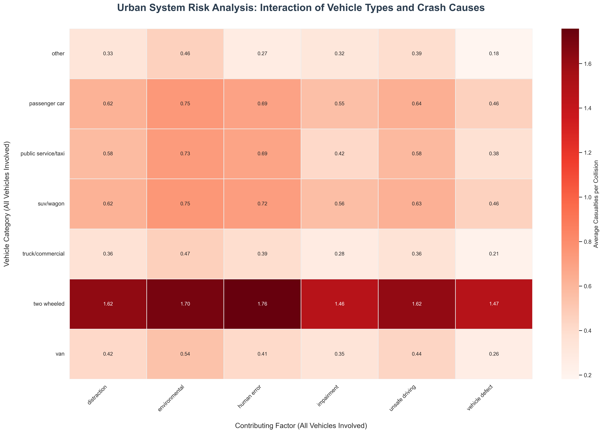
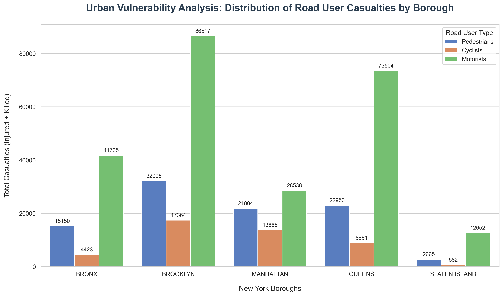
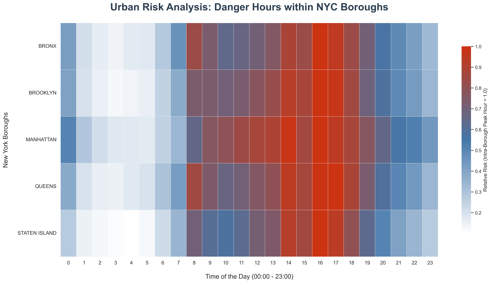
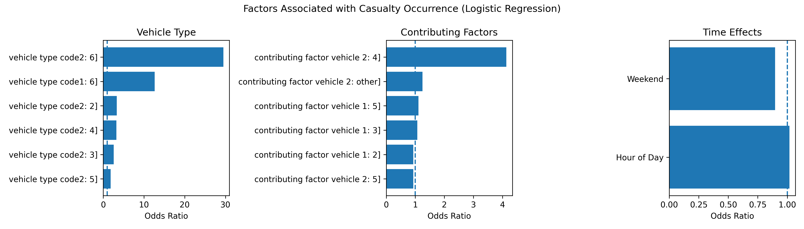

# Motor Vehicle Collisions Analysis

## Beyond the Noise

### Team Members
* **Belinay Keleş** - 122203088
* **Ahmet Kağan Çelenk** - 121203114
* **İrem Ural** - 121203037
* **Sude Şintürk** - 121203034

## Data

* **Dataset Name:** Motor Vehicle Collisions - Crashes
* **Source:** NYC Open Data
* **Link:** [Motor Vehicle Collisions - Crashes](https://data.cityofnewyork.us/Public-Safety/Motor-Vehicle-Collisions-Crashes/h9gi-nx95/about_data)

## Research Questions
Q1: How does the frequency of accidents vary by time of day and by different boroughs of New York; can "danger hours" and "danger zones" be identified?

Q2: Is there a clear relationship between different crash causes and the types of vehicles involved that increase injury or death rates?

Q3: Can the number of injuries in an accident be predicted using variables such as accident time, location, vehicle type, and cause of accident?

## Data Preprocessing

Extensive data preprocessing was conducted to ensure data quality, reduce noise, and focus the analysis on relevant crash scenarios. The following steps outlined the cleaning pipeline:

* **Initial Missing Value Handling:** Rows containing null values in critical identifying columns, specifically CRASH TIME and BOROUGH, were removed.

* **Focusing on 1-2 Vehicle Crashes:** The scope was narrowed to incidents involving only one or two vehicles. Rows where vehicle/factor information existed for a 3rd, 4th, or 5th vehicle were dropped. Subsequently, columns related to vehicles 3, 4, and 5 were removed entirely from the dataset.

* **Dimensionality Reduction:** High-cardinality location features considered unnecessary for this specific analysis were dropped to reduce noise. These included ZIP CODE, LATITUDE, LONGITUDE, LOCATION, and all street name columns (ON STREET NAME, CROSS STREET NAME, OFF STREET NAME).

* **Preserving Single-Vehicle Incidents:** A targeted null handling strategy was applied. While most remaining system nulls were cleared, missing values in VEHICLE TYPE CODE 2 and CONTRIBUTING FACTOR VEHICLE 2 were explicitly filled with "Not Applicable". This ensured that single-vehicle crashes were not lost during data cleaning.

* **Feature Engineering - Vehicle Type Standardization:**
The raw vehicle type data contained high noise (typos, redundant categories). Analysis showed the top 20 vehicle types covered 97% of the data.

These top types were consolidated into broader categories (e.g., grouping "bike", "motorcycle", "bicycle" into "two wheeled"). Rare or irrelevant types outside this consolidated list were removed.

* **Feature Engineering - Contributing Factor Standardization:**
Similar to vehicle types, over 80 diverse contributing factors were analyzed. Nonsensical values were removed.

Remaining factors were grouped into actionable categories such as "distraction", "unsafe driving", "impairment", and "vehicle defect".

* **Categorical Encoding:** The newly standardized vehicle type and contributing factor columns underwent categorical encoding to prepare them for analysis.

* **Temporal Filtering:** The dataset, originally dating back to 2012, was filtered to focus on the most recent trends between 2021 and 2025.

## Visuals for Preprocessing
Below are selected insights derived from the cleaned and processed NYC collision data.

* ### Vehicle Type vs. Crash Cause Interaction
This heatmap visualizes the relationship between the types of vehicles involved and the primary contributing factors, color-coded by the average number of casualties per collision.

**Insight:** This heatmap reveals that **two-wheeled vehicles** face the highest risk, with average casualties per collision reaching near-maximum levels (0.86 - 0.99) across all contributing factors, especially during **impairment-related** incidents.

* ### Vulnerability by Borough and User Type
This chart highlights the distribution of total casualties (injured + killed) across NYC boroughs, segmented by the type of road user (pedestrians, cyclists, or motorists).

**Insight:** **Brooklyn** and **Queens** exhibit the highest volume of total casualties; notably, Brooklyn leads in motorist injuries, while Manhattan shows a high concentration of pedestrian and cyclist casualties relative to its size.

* ### High-Risk Hours Across Boroughs
A temporal heatmap identifying the "danger hours" within each borough, showing peak times for collision risks throughout the day (00:00 - 23:00).

**Insight:** The relative risk peak is synchronized across all boroughs, identifying the window between **14:00 and 19:00 (Rush Hour)** as the most dangerous period for commuters in New York City.

## Insights from the Data

&emsp;In this project, we implemented a Logistic Regression model to predict the probability of a casualty in NYC vehicle collisions. Beyond prediction, we utilized the model for descriptive analysis to identify the key risk factors that characterize high-risk accidents.

&emsp;The findings from our logistic regression analysis reveal the critical factors determining the risk of injury and death (casualty) in New York City traffic accidents from a professional perspective:

* **The Greatest Risk** The most striking finding of our analysis is the massive disparity in risk between different vehicle types. Our model demonstrates that when a "Two-Wheeled" vehicle (Motorcycle or Bicycle) is involved in an accident, the risk of injury or death is approximately 30 times higher compared to reference values. This data scientifically proves that urban safety policies must prioritize the protection of "vulnerable road users"; measures such as dedicated bike lanes and stringent helmet inspections will have a direct, life-saving impact.

* **The Danger of Single-Vehicle and Uncertain Accidents** When examining contributing factors, it was observed that cases in the "Not Applicable" category (where a second vehicle is not actively involved or the factor is not specifically listed) increase the risk ratio by more than 4 times. This indicates that single-vehicle accidents, such as hitting a fixed object or a pedestrian, often result in much more severe consequences. Additionally, the high risk associated with "Unknown" primary vehicle types underscores the gravity of hit-and-run incidents or the involvement of unregistered vehicles in high-severity collisions.

* **The Effect of Time** Contrary to common urban myths, variables such as "Weekend" or "Hour of Day" do not exert as radical an influence on injury risk as vehicle type does. The fact that the Odds Ratio values for these variables remain very close to the 1.0 threshold proves that casualty risk is not strictly time-bound. The primary determinant is not "when" the accident occurs, but rather "which vehicles" are involved and the specific nature of the collision kinetics.

* **Strategic Insight** This project demonstrates that instead of focusing solely on reducing general traffic congestion, much more effective results can be achieved through pinpoint inspections and infrastructure improvements targeting high-risk vehicle groups (motorcycles/bicycles) and critical accident scenarios. For city planners and policymakers, the fundamental priority should be the minimization of high-kinetic collision scenarios rather than merely managing total vehicle volume.

## Model Outputs

&emsp;Based on the model performance metrics, the logistic regression model exhibits a "sensitive yet cautious" profile in identifying high-risk cases (Casualty). The model demonstrates a safety-oriented success by identifying 79% of actual injury-related accidents (Recall: 0.79), thereby minimizing the probability of overlooking potential injury risks (false negatives).

&emsp;However, this high sensitivity comes at the cost of low precision (0.41), meaning the model frequently classifies non-casualty accidents as "risky," resulting in a high rate of "false alarms." The low overall accuracy (0.51) indicates that the inherent variability in traffic accidents is exceptionally high and that the model struggles to achieve flawless predictions using only basic features such as vehicle type and time. Ultimately, the model functions as a strategic early warning system that prioritizes capturing high-risk cases even at the expense of lower overall precision.

### Model Metrics Table

| Class | Precision | Recall | F1-Score | Support |
| :--- | :---: | :---: | :---: | :---: |
| **No Casualty** | 0.76 | 0.36 | 0.49 | 33,745 |
| **Casualty** | 0.41 | 0.79 | 0.54 | 18,797 |
| **Accuracy** | | | **0.51** | **52,542** |
| **Macro Avg.** | 0.58 | 0.58 | 0.51 | 52,542 |
| **Weighted Avg** | 0.63 | 0.51 | 0.50 | 52,542 | 

## Project Website Link

